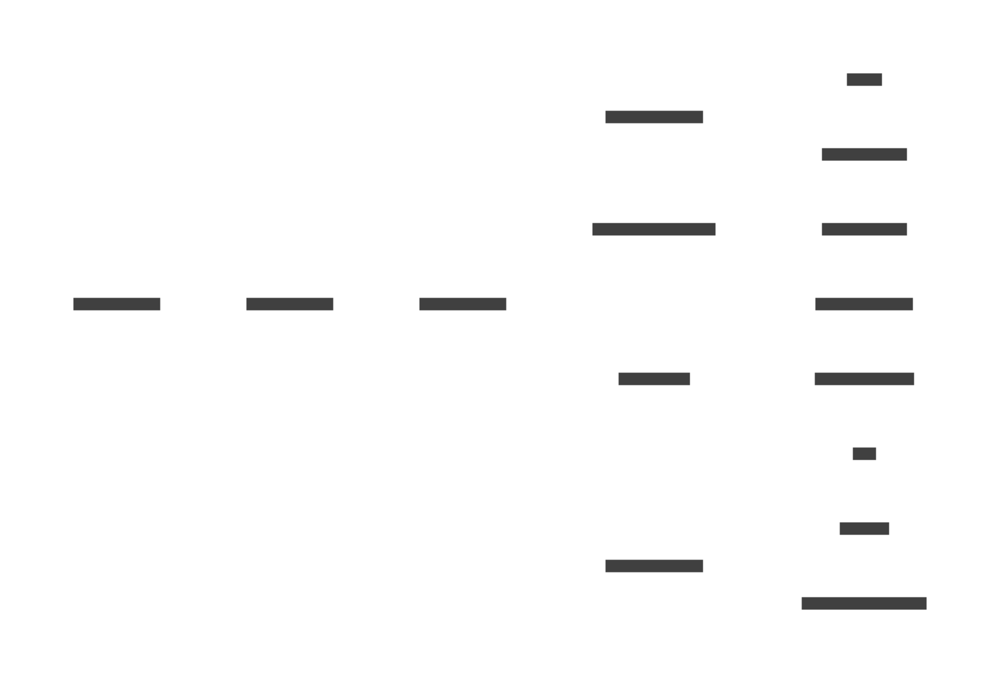

# NotAlone

### ✍️ 요약

- 머신러닝을 활용한 쇼핑몰 사이트
- 시작날짜 : 2023년 12월 14일
- V0 완료날짜 : 2023년 12월 20일

### 🛠 사용 기술 및 라이브러리

- OS
  - Windows10
- Language / Tool
  - Java / VisualStudioCode
  - Python
  - HTML, CSS, JavaScript
- Database / Tool
  - MySQL / DBeaver
- 형상관리
  - Git
- 개발도구
  - Docker

### ERD

- 초안 : <https://www.erdcloud.com/d/q39EXwXTKuBQk9YRk>
- 최종
  

### 주요기능

1. 로그인
    - 아이디, 비밀번호를 검증하여 로그인한다.
2. 회원가입
    - 아이디 중복일 경우 회원가입 불가하다.
    - 비밀번호와 비밀번호 확인이 다를 경우 회원가입 불가하다.
    - 비밀번호는 암호화하여 데이터베이스에 저장한다.
3. 메인
    - 모든 물품 리스트를 바둑판 형식으로 나타낸다.
4. 물품상세
    - 물품 이미지, 물품명, 물품금액 등 물품에 관련된 정보를 제공한다.
5. 장바구니
    - 사용자가 예약한 물품 목록이 나타난다.
6. 마이페이지
    - 사용자가 최종적으로 구매한 목록이 나타난다.
7. 관리자
    - 5일간 매출과 월간 매출을 차트로 볼 수 있다.
    - 판매량 예측을 제공받는다.

### 작성문서

- WBS
- 상세설계서
- 상세 요구사항 명세서
- 일간 업무 보고서
- Issue List

### 주요 이슈

#### Cartitem

#### transaction

